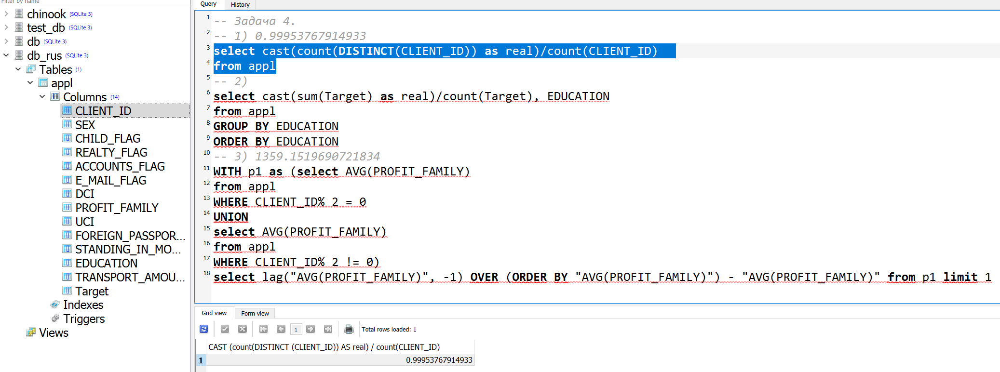
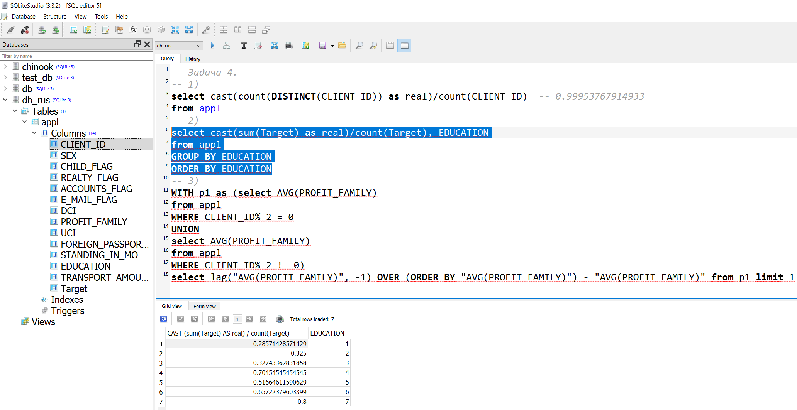
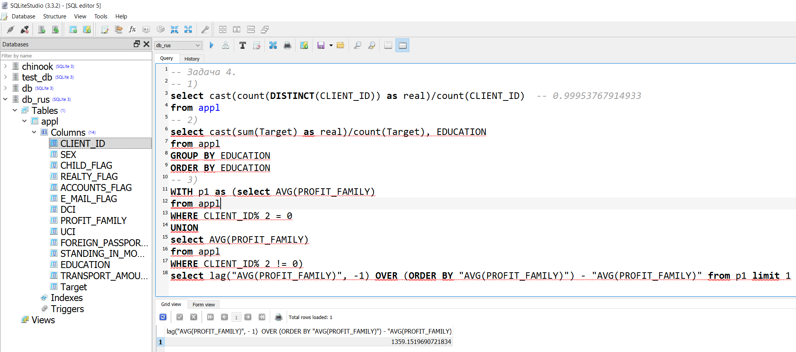

# BANK_russian_standard_contest

<!-- #region -->
<p align="center">

</p>

В этом репозитории представлено решение контеста от Банк «Русский стандарт», описание всех заданий, а так же решение "Задача 1." и "Задача 2." представлены в:
```
задание для кандидатов БМКП БРС_solution.docx
```
Решение "Задача 3." и "Задача 5." представлены в формате jupiter ноутбука и дублирующего html файла (для удбного просмотра в браузере):
```
BANK_russian_standard.ipynb, BANK_russian_standard.html
```

Решение "Задача 4." представлено в виде sql скрипта
```
SQL_skript.txt
```

Скрины с выводом решения (численный ответ) подзадач 1,2 и 3 ("Задача 4.") соответственно:
<!-- #region -->
<p align="center">

</p>


<!-- #region -->
<p align="center">

</p>

<!-- #region -->
<p align="center">

</p>
